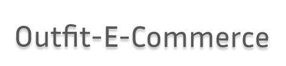

<h1  align="center"> Outfit-E-commerce </h1>
<p align="center">Este é um projeto back end simples que armazena informações sobre um e-commerce de roupas.</p>

<p align="center"> 
 <a href="#%EF%B8%8F-licença">Licença</a>&nbsp;&nbsp;&nbsp;|&nbsp;&nbsp;&nbsp;
 <a href="#-documentação-da-api">Documentação</a>&nbsp;&nbsp;&nbsp;|&nbsp;&nbsp;&nbsp;
 <a href="#-como-rodar-o-projeto">Como rodar</a>&nbsp;&nbsp;&nbsp;|&nbsp;&nbsp;&nbsp;
 <a href="#-como-foi-criado-o-banco-de-dados">Database</a>&nbsp;&nbsp;&nbsp;|&nbsp;&nbsp;&nbsp;
 <a href="#-modelagem-do-banco-de-dados">Modelagem</a>&nbsp;&nbsp;&nbsp;|&nbsp;&nbsp;&nbsp;
 <a href="#-dependências">Dependências</a>&nbsp;&nbsp;&nbsp;|&nbsp;&nbsp;&nbsp;
 <a href="#-tecnologias-utilizadas">Tecnologias</a>
</p>



---
&nbsp;
## 🚀 Tecnologias utilizadas
Esse projeto foi desenvolvido utilizando as seguintes tecnologias:

- Node.JS
- Javascript
- Git e Github
- MySQL
- Eslint

&nbsp;
## ✅ Dependências
Esse projeto utiliza as seguintes dependências do **Node.js** para seu pleno desenvolvimento:

- Express
- Nodemon
- mysql

&nbsp;
## 📋 Modelagem do banco de dados
&nbsp;

<p>O relacionamento entre o produto e a categoria é many to many, pois um produto pode ter mais de uma categoria e uma categoria pode ter nenhum ou vários produtos.</p>
<p>O usuário seria utilizado para checar se a conta cadastrada é um administrador para validar o sistema e poder acessá-lo com todas as permissões de rota.</p>


&nbsp;
## 📈 Como foi criado o Banco de dados
para criar uma conexão com o banco de dados SQL foi utilizadas as seguintes ferramentas:

- Programa **Xampp** para hospedagem do servidor do banco de dados. [Baixe o programa por aqui!](https://www.apachefriends.org/pt_br/index.html)
- Dentro do Xampp, foi utilizado o banco de dados **Mysql** e o servidor web **Apache**.


&nbsp;
## 💻 Como rodar o projeto
Para rodar o projeto localmente no seu computador, as etapas a seguir podem ser seguidas:

1. Use o comando: `git clone https://github.com/letdayy/Outfit-E-commerce.git` no terminal de sua preferência. Entretanto, o terminal do [git](https://git-scm.com) é fortemente recomendado.

2. Abra o repositório copiado no editor de código de sua preferência. [clique aqui caso ainda não tenha um](https://code.visualstudio.com)

3. Abra o programa Xampp e então inicie os servidores Mysql e Apache. [Visualização](.github/Xampp_tutorial.png)

4. Com os servidores iniciados, aperte no botão **admin** no servidor Mysql. [visualização](.github/Xampp_admin.png) 

5. na seção **Admin**, crie um banco de dados chamado "outfit-e-commerce" e então importe o banco de dados presente no repositório para o servidor. [visualização](.github/importDatabase.png) 

6. Execute o comando `npm install` para instalar as dependências necessárias para o funcionamento do projeto:
```bash
npm install
```

7. Execute o comando `npm start` para iniciar o servidor em sua máquina.
 ```bash
npm start 
```
8. acesse o servidor através da rota `http://localhost:8800`


&nbsp;
## 📝 Documentação da API
O link abaixo levará para a documentação de como usar a **API**: 

&nbsp;
[Clique aqui para ver a documentação online!](https://documenter.getpostman.com/view/22741061/2s93JxsMY1)


&nbsp;
## 🖊️ Licença
Este projeto está sob a Licença MIT. Veja o arquivo [LICENSE](LICENSE) para mais detalhes.

---
**Projeto feito por Letícia Dayane. Qualquer dúvida, Entre em contato pelo e-mail lcdayane49@gmail.com.**
